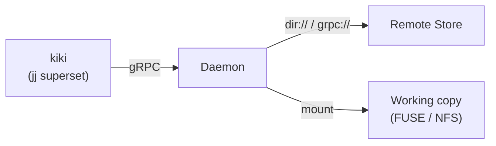

# kiki

A virtual filesystem for your repos, backed by
[jj](https://jj-vcs.github.io/jj/latest/).

```bash
kiki kk init dir:///shared/store ~/work/myproject
cd ~/work/myproject
vim src/main.rs          # writes sync to the shared store
```

On another machine pointed at the same store:

```bash
kiki workspace update-stale   # reconcile the operation log
cat src/main.rs               # changes are there
```

The repo is a daemon-managed mount point. Files appear when you
read them and sync when you write them.

> **Experimental.** Works end-to-end on Linux and macOS.
> Not yet ready for real projects.

## The idea

Google has [CitC](https://abseil.io/resources/swe-book/html/ch16.html#clients_in_the_cloud_citc).
Meta has [EdenFS](https://github.com/facebook/sapling/tree/main/eden/fs).
kiki is an open-source attempt at the same idea: a daemon-backed
virtual filesystem that serves your repo as a directory and syncs
content in the background. It's built on
[jj](https://jj-vcs.github.io/jj/latest/) and converging to git
— so you can push to GitHub and external contributors just
`git clone`.

## What works today

**Instant workspaces.** No checkout, no clone. Mount a repo,
`cd` into it, start working. Multiple workspaces share content;
each one is a FUSE (Linux) or NFS (macOS) mount.

**Background sync.** Writes flow to the remote store
automatically. Reads fetch on demand and cache locally.

**Git interop.** `kiki git push/fetch/remote` routes through
the daemon. The storage format is converging to git objects, so
GitHub and GitLab work as remotes.

## GitHub example

```bash
kiki kk daemon run &   # will be automatic in a future release

kiki kk init dir:///shared/store ~/work/myproject
cd ~/work/myproject

kiki git remote add origin git@github.com:yourorg/myproject.git
kiki git fetch --remote origin

# work normally
kiki describe -m "fix auth bug"
vim src/auth.rs

# push to GitHub — standard git protocol
kiki git push --remote origin --bookmark main

# teammates without kiki just use git
git clone git@github.com:yourorg/myproject.git
```

## How it works

kiki is a [jj](https://jj-vcs.github.io/jj/latest/) superset —
all jj commands work unchanged. `kiki git push/fetch/remote`
routes through the daemon automatically on kiki repos. The `kk`
subcommand is only needed for operations that collide with jj
builtins (`kk init`, `kk status`).



The **daemon** runs on your machine. It serves the virtual
filesystem, caches content locally, and syncs with a remote in
the background. The **remote** can be a shared directory, another
daemon, or (future) S3.

## Status

Working: FUSE (Linux), NFS (macOS), read/write/snapshot,
multi-machine sync via `dir://`, `ssh://`, and `kiki://`,
durable local storage, operation log sharing, `git push`/`git fetch`.

In progress: `.gitignore`-aware VFS, git object convergence,
async offline push queue.

Designed: [managed workspaces](./docs/WORKSPACES.md),
[code review](./docs/REVIEW.md),
[auth](./docs/AUTH.md),
[ref protection](./docs/REF_PROTECTION.md).

## Get started

See the **[User Guide](./docs/USER_GUIDE.md)** for build
instructions and a full walkthrough.

The **[design docs](./docs/)** cover the roadmap, architecture
decisions, and every future feature in detail.

## License

TBD
