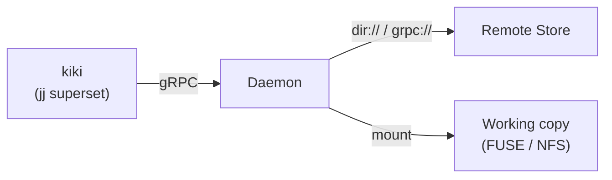

# kiki

Edit a file. Your teammate sees it. No commit, no push, no pull.

```bash
cd ~/work/myproject
vim src/main.rs          # just edit. that's it.
```

Meanwhile, on your other machine — or your teammate's:

```bash
cd ~/work/myproject
cat src/main.rs          # it's already there.
```

There's no clone. The repo is a daemon-managed mount point.
Files appear when you read them, sync when you write them,
and every tool you already use — `ls`, `vim`, `gcc`, your IDE —
just works.

> **Experimental.** Works end-to-end on Linux and macOS.
> Not yet ready for real projects.

## The idea

Google has [CitC](https://abseil.io/resources/swe-book/html/ch16.html#clients_in_the_cloud_citc).
Meta has [EdenFS](https://github.com/facebook/sapling/tree/main/eden/fs).
You have `git clone` and then you wait.

kiki gives you the same thing they have: a virtual filesystem
that serves your repo as a directory, backed by a daemon that
syncs everything in the background. But it's open source, built
on [jj](https://jj-vcs.github.io/jj/latest/), and converging
to git — so you can push to GitHub and external contributors
just `git clone`.

## What you get

**Instant workspaces.** No checkout. No clone. Mount a repo,
`cd` into it, start working. Spin up ten workspaces for ten
tasks — they share content, each one is a FUSE mount.

**Sync that disappears.** Write on your laptop, read on your
desktop. Close the lid, open it on a plane — changes queue
offline and drain when you reconnect.

**Git in, git out.** The storage format is converging to git
objects. Push to GitHub, fetch from GitLab. No walled garden.

## Works with GitHub

```bash
kiki kk daemon run &   # will be automatic in a future release

kiki kk init ~/work/myproject
cd ~/work/myproject

kiki git remote add origin git@github.com:yourorg/myproject.git
kiki git fetch --remote origin

# work normally
kiki new -m "fix auth bug"
vim src/auth.rs

# push to GitHub — standard git protocol
kiki git push --remote origin --bookmark main

# teammates without kiki just use git
git clone git@github.com:yourorg/myproject.git
```

kiki's internal format converges to git objects. GitHub is a
first-class remote, not an afterthought. Your team uses kiki
for the sync + VFS experience; everyone else uses plain git.

## How it works

kiki is a [jj](https://jj-vcs.github.io/jj/latest/) superset —
all jj commands work unchanged. `kiki git push/fetch/remote`
routes through the daemon automatically on kiki repos. The `kk`
subcommand is only needed for operations that collide with jj
builtins (`kk init`, `kk status`).



The **daemon** runs on your machine. It serves the virtual
filesystem, caches content locally, and syncs with a remote in
the background. The **remote** can be a shared directory, another
daemon, or (future) S3.

## Status

Working today: FUSE (Linux), NFS (macOS), read/write/snapshot,
multi-machine sync via `dir://` and `grpc://`, durable local
storage, operation log sharing. 192 tests pass.

In progress: `.gitignore`-aware VFS, git object convergence,
`git push`/`git fetch`, async offline push queue.

Designed: [managed workspaces](./docs/WORKSPACES.md),
[code review](./docs/REVIEW.md),
[auth](./docs/AUTH.md),
[ref protection](./docs/REF_PROTECTION.md).

## Get started

See the **[User Guide](./docs/USER_GUIDE.md)** for build
instructions and a full walkthrough.

The **[design docs](./docs/)** cover the roadmap, architecture
decisions, and every future feature in detail.

## License

TBD
