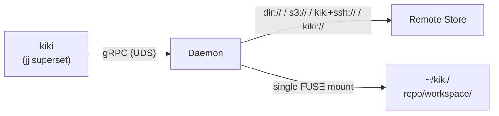

# kiki User Guide

kiki is a virtual filesystem for your repos, built on
[jj](https://jj-vcs.github.io/jj/latest/). A daemon serves the working copy
through FUSE (Linux) or NFS (macOS) and handles storage, caching, and remote
synchronization.

> **Status:** experimental. The core workflow (clone from git or kiki remote,
> edit, commit, sync between peers, multiple workspaces, daemon restart
> persistence) works end-to-end on Linux. macOS support is present but less
> tested. Not yet suitable for production repositories.

## Architecture overview



- **kiki** (`kiki`): A jj superset binary that talks to the local daemon over
  a Unix domain socket. Stores no persistent data itself. All standard jj
  commands (`kiki log`, `kiki new`, `kiki describe`, `kiki diff`, etc.) work
  normally. Top-level commands handle repo and workspace lifecycle (`kiki clone`,
  `kiki workspace`). The `kk` subcommand provides other kiki-specific operations.
- **Daemon**: Long-lived process on the local machine, auto-started on first
  command. Serves a single FUSE mount at `~/kiki/` containing all repos and
  workspaces. Manages per-repo git stores (shared across workspaces), a durable
  redb database, and optionally syncs blobs and operation state to a remote.
  No manual configuration needed.
- **Remote** (`dir://`, `s3://`, `kiki+ssh://`, or `kiki://`): Content-addressed
  blob store with compare-and-swap mutable refs. `s3://` remotes use the AWS
  SDK default credential chain. `kiki+ssh://` remotes need only the `kiki` binary on
  the server — the local daemon manages a persistent SSH tunnel to the remote
  daemon. `kiki://` remotes connect to a running daemon on another machine
  (e.g., over Tailscale).

## Prerequisites

- **Linux:** `fusermount3` (usually provided by the `fuse3` package). It ships
  as a setuid binary on most distros, so no `sudo` is needed to mount.
- **macOS:** `mount_nfs` (ships with macOS). No extra packages required, but
  loopback NFS has occasional version-specific quirks. The managed workspace
  namespace (`~/kiki/`) requires the macOS NFS RootFs adapter (not yet
  available) — macOS currently uses per-workspace NFS mounts via `kk init`.
- **Rust toolchain:** edition 2024 (nightly or stable 1.85+).
- **jj** 0.40.x (jj-lib 0.40 is the pinned dependency).

## Building

```bash
cargo build --workspace            # debug build
cargo build --workspace --release  # release build
```

The workspace produces one binary:

| Binary | Location (debug)      | Description                          |
|--------|-----------------------|--------------------------------------|
| `kiki` | `target/debug/kiki`   | jj superset + daemon (unified binary)|

## Configuration

### Zero-config defaults

kiki requires **no configuration** for local use. The daemon is auto-started
when you run your first `kiki` command.

Two separate directories:

```
~/.local/share/kiki/            # KIKI_HOME — state directory
~/.local/share/kiki/daemon.sock # CLI ↔ daemon socket
~/.local/share/kiki/daemon.pid  # daemon PID file
~/.local/share/kiki/daemon.log  # daemon log
~/.local/share/kiki/store/      # git stores, redb, workspace metadata
~/.local/share/kiki/config.toml # optional config

~/kiki/                          # KIKI_MOUNT — FUSE mount (repos/workspaces)
```

The FUSE mount point (`~/kiki/`) must be empty before the daemon mounts it.
Repos appear as `~/kiki/<repo>/<workspace>/` when the daemon is running.

### Optional config file

`$KIKI_HOME/config.toml` can override defaults:

```toml
# All fields are optional.

# TCP listener for daemon-to-daemon remote access (kiki:// scheme).
# Default: disabled.
# grpc_addr = "[::1]:12000"

# Override storage directory (default: $KIKI_HOME/store/).
# storage_dir = "/path/to/storage"

# NFS port range (macOS only).
# [nfs]
# min_port = 12000
# max_port = 12010
```

### Environment overrides

| Variable | Effect |
|----------|--------|
| `KIKI_HOME` | State directory (stores, config, daemon runtime). Default: `~/.local/share/kiki`. |
| `KIKI_MOUNT` | FUSE mount point (repos/workspaces appear here). Default: `~/kiki`. |
| `KIKI_SOCKET_PATH` | Override socket location. Disables auto-start (user manages daemon). |
| `RUST_LOG` | Control daemon log verbosity (e.g., `info`, `debug`). |

## Getting started

### 1. Clone a repository

The daemon starts automatically on your first command — no manual setup.
A single FUSE mount at `~/kiki/` serves all repos and workspaces.

Run `kiki kk setup` to verify prerequisites (fusermount3, mount root) before
your first clone, or just dive in — the error messages will guide you.

```bash
kiki clone <url> [--name <name>]
```

**`<url>`** can be a git remote or a kiki-native remote:

**Git remotes** (fetched via `git fetch`, explicit push/pull):

| Scheme          | Example                                  | Description |
|-----------------|------------------------------------------|-------------|
| `https://`      | `https://github.com/org/repo.git`        | Git over HTTPS. |
| `ssh://`        | `ssh://git@github.com/org/repo.git`      | Git over SSH. |
| SCP-style       | `git@github.com:org/repo.git`            | Git over SSH (shorthand). |

**Kiki-native remotes** (real-time sync, full-fidelity):

| Scheme          | Example                                  | Description |
|-----------------|------------------------------------------|-------------|
| `dir://`        | `dir:///tmp/kiki-remote`                 | Filesystem-backed remote. Good for local testing and single-machine use. |
| `s3://`         | `s3://my-bucket/repos/project`           | S3-backed remote. Uses AWS SDK credentials and bucket permissions. |
| `kiki+ssh://`   | `kiki+ssh://user@host/data/store`        | SSH transport to another kiki daemon. The local daemon manages a persistent SSH tunnel. |
| `kiki://`       | `kiki://myserver:12000`                  | Another kiki daemon's gRPC endpoint. Enables peer-to-peer sync (e.g., over Tailscale). |
| `grpc://`       | `grpc://[::1]:12000`                     | Alias for `kiki://`. |

**`--name`** overrides the repo name (default: derived from the URL's last
path component). The repo name becomes a directory under `~/kiki/`.

**`--remote`** (git clones only) attaches a kiki-native remote for real-time
sync alongside the git origin.

Examples:

```bash
# Clone from GitHub
kiki clone git@github.com:myorg/my-project.git
cd ~/kiki/my-project/default

# Clone from GitHub with a kiki remote for team sync
kiki clone git@github.com:myorg/my-project.git --remote s3://team-bucket/my-project
cd ~/kiki/my-project/default

# Clone from a filesystem remote
kiki clone "dir:///shared/kiki-store"
cd ~/kiki/kiki-store/default

# Clone from S3
kiki clone "s3://my-bucket/repos/my-project"
cd ~/kiki/my-project/default

# Clone over kiki+ssh
kiki clone "kiki+ssh://user@myserver/data/myproject"
cd ~/kiki/myproject/default

# Clone with a custom name
kiki clone "kiki+ssh://user@myserver/data/myproject" --name mp
cd ~/kiki/mp/default

# Clone from another daemon (e.g., over Tailscale)
kiki clone "kiki://myserver:12000" --name myproject
cd ~/kiki/myproject/default
```

Each clone creates a `default` workspace. The workspace appears immediately
at `~/kiki/<name>/default/`. For git clones, the default branch's content
is materialized on clone — `ls` shows your files right away without needing
to check out a branch manually.

### 2. Create workspaces

Workspaces are lightweight — they share the repo's git object store and
only track their own checkout pointer and dirty state. Creating a workspace
is instant.

```bash
kiki workspace create <repo>/<workspace> [--revision <rev>]
```

Examples:

```bash
# Create a workspace for a feature branch
kiki workspace create myproject/fix-auth
cd ~/kiki/myproject/fix-auth

# Create a workspace at a specific revision
kiki workspace create myproject/review --revision @--

# List workspaces
kiki workspace list myproject

# Delete a workspace
kiki workspace delete myproject/fix-auth
```

The default checkout target is the parents of the source workspace's
working-copy commit (matching `jj workspace add` behavior). Use
`--revision` to override.

### Ad-hoc mounts

For one-off mounts outside the managed namespace:

```bash
kiki kk init <remote> [destination]
```

This creates a standalone mount at `destination` (default: `.`) without
registering it in the `~/kiki/` namespace. Useful for testing or
when you need a mount at a specific path.

### 3. Use standard jj commands

Once cloned, all standard jj commands work via the `kiki` binary:

```bash
cd ~/kiki/myproject/default

# Create files (writes go through the VFS to the daemon)
mkdir src
echo 'fn main() {}' > src/main.rs

# Check status
kiki st

# Create a new change
kiki new

# View history
kiki log

# Describe the current change
kiki describe -m "add main.rs"

# View operation log
kiki op log

# List files at a revision
kiki file list -r @-

# Diff
kiki diff
```

The daemon snapshots the working copy automatically on each kiki command, just
like regular jj. The difference is that snapshots happen in the daemon's
in-memory inode slab and persist to the redb store, rather than scanning the
filesystem.

Commands work in any workspace — `cd ~/kiki/myproject/fix-auth` and run
`kiki log` to see the same repo's history from a different working-copy
commit.

### Using stock git commands

Every kiki workspace synthesizes a `.git` file pointing at a per-workspace
git worktree (own HEAD, own index) backed by the shared object store.
This means stock git commands work inside kiki mounts:

```bash
cd ~/kiki/myproject/default

# git status, diff, log all work
git status
git log --oneline

# You can commit with git — kiki detects the change automatically
echo 'hello' > new-file.txt
git add new-file.txt
git commit -m "committed with git"

# kiki log now shows the git commit
kiki log
```

The import happens automatically: before every `kiki` command, a dispatch
hook checks whether HEAD changed externally (e.g. via `git commit`) and
imports the new commit into jj's graph. Each workspace has its own HEAD
and index, so `git add` / `git commit` in one workspace doesn't interfere
with another.

### 4. Daemon management

The daemon is invisible in normal use. For debugging:

```bash
kiki kk daemon status       # PID, socket path, mount count
kiki kk daemon logs         # tail the log file
kiki kk daemon logs -f      # follow (like tail -f)
kiki kk daemon stop         # graceful shutdown
kiki kk daemon socket-path  # print the resolved socket path
```

To see all mounted repositories:

```bash
kiki kk status
```

## Multi-user / multi-machine sync

When two CLIs point at the same remote (e.g., an `s3://` bucket prefix, a shared
`kiki+ssh://` server, a `dir://` path, or a `kiki://` peer), kiki serializes
operation-log advances via compare-and-swap on the remote's mutable ref catalog.
This means:

- **Blob sync:** Every write is pushed to the remote immediately
  (write-through). Reads fall through to the remote on local cache miss
  (read-through with verification).
- **Operation sync:** Operation and view data route through the daemon with
  write-through/read-through semantics. A peer CLI can read the full operation
  history that another CLI wrote.
- **Op-head arbitration:** The `op_heads` ref uses CAS retry so concurrent
  `kiki new` from two machines won't silently clobber each other's op head.

### Example: two machines sharing a dir:// remote

```bash
# Machine A
kiki clone "dir:///shared/remote" --name project
cd ~/kiki/project/default

# Machine B
kiki clone "dir:///shared/remote" --name project
cd ~/kiki/project/default

# Both machines see each other's commits and operations
```

### Example: two machines sharing an s3:// remote

Configure AWS credentials using the standard AWS SDK mechanisms, such as
`AWS_ACCESS_KEY_ID` / `AWS_SECRET_ACCESS_KEY`, `~/.aws/credentials`, SSO, ECS,
or instance metadata. Both machines must have permission to read, write, list,
and conditionally update objects under the same bucket prefix.

```bash
# Machine A
kiki clone "s3://my-bucket/repos/project"
cd ~/kiki/project/default

# Machine B
kiki clone "s3://my-bucket/repos/project"
cd ~/kiki/project/default

# Both machines see each other's commits and operations
```

### Example: two machines sharing a kiki+ssh:// remote

No daemon needed on the server. Each machine SSHes to the server and
reads/writes the shared store directory directly:

```bash
# Machine A
kiki clone "kiki+ssh://user@server/data/myproject"
cd ~/kiki/myproject/default

# Machine B
kiki clone "kiki+ssh://user@server/data/myproject"
cd ~/kiki/myproject/default

# Both machines see each other's commits and operations
```

### Example: peer-to-peer via kiki:// (Tailscale, LAN)

Every daemon also serves the `RemoteStore` gRPC service, so any daemon can act
as the remote for another. Use `kiki://` (or the `grpc://` alias). Requires
`grpc_addr` in the server's `~/.config/kiki/config.toml`:

```bash
# Machine A: enable TCP listener in ~/.config/kiki/config.toml
#   grpc_addr = "0.0.0.0:12000"

# Machine B: use Machine A as the remote (e.g., over Tailscale)
kiki clone "kiki://machine-a:12000" --name project
cd ~/kiki/project/default
```

## Working with GitHub

Clone directly from GitHub:

```bash
kiki clone git@github.com:yourorg/my-project.git
cd ~/kiki/my-project/default
```

This creates the repo with `origin` pointing at GitHub. No intermediate
kiki remote needed.

### Push to GitHub

```bash
# Work normally
mkdir src && echo 'fn main() {}' > src/main.rs
kiki describe -m "initial commit"

# Push to GitHub (uses your SSH keys / credentials)
kiki git push --remote origin --bookmark main
```

### Fetch from GitHub

```bash
# Pull changes (e.g., merged PRs, teammate pushes)
kiki git fetch --remote origin

# See what came in
kiki log
```

### Team setup with a kiki remote

For real-time sync between team members, combine a git origin with a
kiki remote:

```bash
# First developer sets up the project
kiki clone git@github.com:yourorg/my-project.git \
    --remote kiki://team-server:12000
cd ~/kiki/my-project/default

# Other developers clone from the kiki remote — git origin is
# inherited automatically
kiki clone kiki://team-server:12000 --name my-project
cd ~/kiki/my-project/default
kiki git remote list
#   origin  git@github.com:yourorg/my-project.git
```

The kiki remote carries the full jj operation log, change-ids, and
commit evolution history. The git remote is a lossy publication channel
for the wider git ecosystem.

### Collaborating with non-kiki users

Your teammates don't need kiki. They use plain git:

```bash
git clone git@github.com:yourorg/my-project.git
cd my-project
# normal git workflow — commit, push, PR, etc.
```

You fetch their work into your kiki workspace with `kiki git fetch`.

## Managing the kiki remote

Each repo can have zero or one kiki-native remote — a full-fidelity sync
channel that carries git objects, jj operations, change-ids, predecessors,
and workspace state.

```bash
# Show the current kiki remote (or "(none)")
kiki remote show

# Attach a kiki remote to an existing repo
kiki remote add s3://team-bucket/myproject

# Remove the kiki remote (repo continues to work local-only)
kiki remote remove
```

Run these from inside a managed workspace (`~/kiki/<repo>/<workspace>/`);
the repo is inferred from cwd.

When you attach a kiki remote (`kiki remote add`), the daemon:
1. Validates connectivity by pushing the empty tree
2. Replicates your git remote configuration (origin, etc.) to the kiki remote
3. Subsequent writes flow through to the remote automatically

When someone else clones from your kiki remote, they inherit the git remote
configuration — so `kiki git remote list` shows the same origins without
manual setup.

## Syncing over SSH

Use a `kiki+ssh://` URL to sync with a remote machine. Only the `kiki` binary
needs to be on the server.

```bash
kiki clone kiki+ssh://user@my-server/data/myproject
cd ~/kiki/myproject/default

# Work normally — syncs to the server over SSH
kiki new -m "fix bug"
vim src/auth.rs
```

A teammate runs the same command. Both of you see each other's changes
through the shared store on the server.

### How it works

On `kiki clone kiki+ssh://...`, the local daemon:

1. **Discovers** the remote socket: `ssh user@host kiki kk daemon socket-path`
2. **Starts** the remote daemon if not running: `ssh user@host kiki kk daemon run --managed`
3. **Opens a persistent tunnel**: `ssh -L local.sock:remote.sock user@host -N`
4. **Connects** a gRPC client to the forwarded socket

The tunnel stays alive for the mount's lifetime — subsequent CLI commands
reuse it with zero SSH handshake cost. The local daemon manages the tunnel
process and cleans up on shutdown.

The full gRPC protocol runs over the tunnel, giving access to all
`RemoteStore` operations (blob CAS + mutable refs). Multiple local
daemons sharing the same remote serialize ref updates via compare-and-swap.

### Prerequisites on the server

1. `kiki` binary in `$PATH`
2. SSH access with key-based auth (BatchMode — no interactive prompts)
3. The remote daemon auto-starts and manages its own storage

## Known limitations

- **Linux-primary.** FUSE on Linux is the well-tested path. macOS NFS works but
  has cache-coherency caveats (mitigated by mounting with `actimeo=0`) and
  occasional Apple-version-specific quirks.
- **No auth or TLS on kiki:// (gRPC).** The daemon listens on localhost only
  by default. For `kiki://` remotes on a LAN or Tailscale, the network
  provides the trust boundary. Don't expose the gRPC port to untrusted
  networks. `kiki+ssh://` remotes inherit SSH's authentication and encryption.
- **S3-compatible backend requirements.** `s3://` remotes rely on conditional
  object writes/deletes for ref compare-and-swap. AWS S3 supports this; S3-like
  services must support `If-Match` / `If-None-Match` on object writes and
  deletes to be safe for concurrent writers.
- **No sparse patterns.** `set_sparse_patterns` is unimplemented. With a
  lazy VFS this is less important than for on-disk working copies.
- **Daemon restart loses uncommitted writes.** The inode slab is in-memory;
  applications with open file descriptors across a daemon restart will see
  ESTALE. Committed content and workspace structure survive restarts — the
  daemon re-reads `repos.toml` and `workspace.toml`, re-creates the namespace,
  and lazily re-hydrates each workspace's tree. Only dirty writes (files
  modified but not yet snapshotted by a jj command) are lost on restart.
- **Synchronous remote push.** `Snapshot` blocks until all new blobs land on
  the remote. Fine for localhost and `dir://`; will need an async push queue
  for higher-latency network remotes.
- **Some jj commands are unimplemented.** `recover`, `rename_workspace`,
  `reset`, and sparse-patterns operations will panic with `todo!`.

## Troubleshooting

**"daemon not reachable"**
If `KIKI_SOCKET_PATH` is set, the CLI won't auto-start the daemon.
Check with `kiki kk daemon status`. Otherwise the daemon auto-starts —
check `kiki kk daemon logs` for errors.

**"mount is not active" on clone**
Run `kiki kk setup` to check prerequisites and create the mount root.
The default mount root is `~/kiki/` (created automatically). If you've
configured a custom `mount_root` (e.g. `/mnt/kiki`), ensure it exists
and is owned by your user.

**"mount failed" / FUSE errors on clone**
Check that `fusermount3` is installed and setuid:
```bash
kiki kk setup               # checks everything
which fusermount3
ls -la $(which fusermount3)  # should show the setuid bit
```

**Stale mount after daemon crash**
If the daemon crashes and leaves a stale FUSE mount, unmount it manually:
```bash
fusermount3 -u ~/kiki
```
Then restart the daemon (`kiki kk daemon run`). It re-reads `repos.toml`
and workspace metadata, re-binds the FUSE mount, and lazily hydrates
workspaces on first access.

**Verbose logging**
```bash
RUST_LOG=debug kiki kk daemon run
# Or check the auto-managed daemon's log:
kiki kk daemon logs -f
```

**SSH tunnel issues**
If a `kiki+ssh://` remote fails to connect:
```bash
# Test SSH connectivity manually
ssh user@host kiki kk daemon socket-path
ssh user@host kiki kk daemon status
```
The local daemon's log (`kiki kk daemon logs`) shows tunnel establishment
details and errors.

## Running tests

```bash
cargo test --workspace
```

Integration tests spin up a temporary daemon per test (using `KIKI_SOCKET_PATH`
for isolation), exercising the full FUSE path. They require `fusermount3` to be
available. Set `KIKI_TEST_DISABLE_MOUNT=1` to skip FUSE in environments where
it's unavailable.
