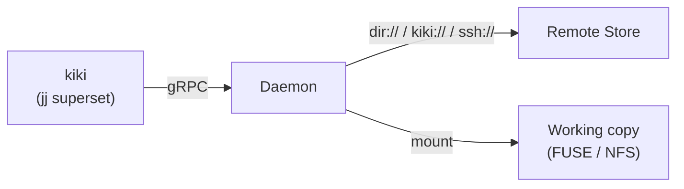

# kiki User Guide

kiki is an experimental remote backend for [jj](https://jj-vcs.github.io/jj/latest/).
It serves the working copy as a virtual filesystem (FUSE on Linux, NFS on macOS)
backed by a daemon that handles storage, caching, and remote synchronization.

> **Status:** experimental. The core workflow (init, edit, commit, sync between
> peers) works end-to-end on Linux. macOS support is present but less tested.
> Not yet suitable for production repositories.

## Architecture overview



- **kiki** (`kiki`): A jj superset binary that talks to the daemon over gRPC.
  Stores no persistent data itself. All standard jj commands (`kiki log`,
  `kiki new`, `kiki describe`, `kiki diff`, etc.) work normally. The `kk`
  subcommand provides kiki-specific operations.
- **Daemon** (`daemon`): Long-lived process on the local machine. Mounts repos
  as virtual filesystems, manages a durable per-mount store (redb), and
  optionally syncs blobs and operation state to a remote.
- **Remote** (`dir://`, `ssh://`, or `kiki://`): Content-addressed blob store
  with compare-and-swap mutable refs. `ssh://` remotes need only the `kiki`
  binary on the server (no daemon). `kiki://` remotes connect to a running
  daemon on another machine (e.g., over Tailscale).

## Prerequisites

- **Linux:** `fusermount3` (usually provided by the `fuse3` package). It ships
  as a setuid binary on most distros, so no `sudo` is needed to mount.
- **macOS:** `mount_nfs` (ships with macOS). No extra packages required, but
  loopback NFS has occasional version-specific quirks.
- **Rust toolchain:** edition 2024 (nightly or stable 1.85+).
- **jj** 0.40.x (jj-lib 0.40 is the pinned dependency).

## Building

```bash
cargo build --workspace            # debug build
cargo build --workspace --release  # release build
```

The workspace produces two binaries:

| Binary   | Location (debug)        | Description              |
|----------|-------------------------|--------------------------|
| `daemon` | `target/debug/daemon`   | The kiki daemon          |
| `kiki`   | `target/debug/kiki`     | jj superset with kiki backend |

## Configuration

### Daemon configuration

The daemon reads a TOML config file passed via `--config`. A minimal example:

```toml
# daemon.toml
grpc_addr = "[::1]:12000"
storage_dir = "/tmp/kiki-storage"

[nfs]
min_port = 12000
max_port = 12010
```

| Key           | Description |
|---------------|-------------|
| `grpc_addr`   | Address the gRPC server listens on. The CLI connects here. |
| `storage_dir` | Root directory for per-mount durable storage. Each mount gets a redb file at `<storage_dir>/mounts/<hash>/store.redb`. Created on demand. |
| `nfs.min_port` / `nfs.max_port` | Port range for NFS mounts (macOS only). |

Optional keys:

| Key             | Default | Description |
|-----------------|---------|-------------|
| `disable_mount` | `false` | Skip the actual VFS mount. Useful for integration testing only. |

### CLI configuration

The CLI needs to know which port the daemon is listening on. Add this to your
[jj config](https://jj-vcs.github.io/jj/latest/config/):

```toml
grpc_port = 12000
```

This must match the port in `grpc_addr` from the daemon config.

You can set it via:

```bash
kiki config set --user grpc_port 12000
```

## Getting started

### 1. Start the daemon

```bash
./target/debug/daemon --config daemon.toml
```

The daemon logs to stderr. Set `RUST_LOG` for more detail:

```bash
RUST_LOG=info ./target/debug/daemon --config daemon.toml
RUST_LOG=debug ./target/debug/daemon --config daemon.toml  # very verbose
```

The daemon persists mount state to disk. On restart, it rehydrates previously
mounted repos automatically.

### 2. Initialize a repository

```bash
kiki kk init <remote> [destination]
```

**`<remote>`** is the remote store URL. Supported schemes:

| Scheme    | Example                          | Description |
|-----------|----------------------------------|-------------|
| `dir://`  | `dir:///tmp/kiki-remote`         | Filesystem-backed remote. Good for local testing and single-machine use. |
| `ssh://`  | `ssh://user@host/data/store`     | SSH transport. No daemon needed on the server — just the `kiki` binary and a directory. |
| `kiki://` | `kiki://myserver:12000`          | Another kiki daemon's gRPC endpoint. Enables peer-to-peer sync (e.g., over Tailscale). |
| `grpc://` | `grpc://[::1]:12000`             | Alias for `kiki://`. |
| (empty)   | `""`                             | No remote. Local-only operation with redb-backed storage. |

**`[destination]`** is the directory to create the repo in (default: `.`).

Examples:

```bash
# Local-only repo (no remote)
kiki kk init "" my-project

# Repo backed by a filesystem remote
kiki kk init "dir:///shared/kiki-store" my-project

# Repo syncing over SSH (no daemon needed on the server)
kiki kk init "ssh://user@myserver/data/kiki-store" my-project

# Repo syncing to another daemon (e.g., over Tailscale)
kiki kk init "kiki://myserver:12000" my-project
```

On Linux, `kiki kk init` tells the daemon to FUSE-mount the working copy at the
destination directory. On macOS, the CLI shells out to `mount_nfs` after the
daemon sets up the NFS server.

### 3. Use standard jj commands

Once initialized, all standard jj commands work via the `kiki` binary:

```bash
cd my-project

# Create files (writes go through the VFS to the daemon)
mkdir src
echo 'fn main() {}' > src/main.rs

# Check status
kiki st

# Create a new change
kiki new

# View history
kiki log

# Describe the current change
kiki describe -m "add main.rs"

# View operation log
kiki op log

# List files at a revision
kiki file list -r @-

# Diff
kiki diff
```

The daemon snapshots the working copy automatically on each kiki command, just
like regular jj. The difference is that snapshots happen in the daemon's
in-memory inode slab and persist to the redb store, rather than scanning the
filesystem.

### 4. Check daemon status

```bash
kiki kk status
```

Lists all currently mounted repositories, showing the working-copy path and
remote URL (if configured).

## Multi-user / multi-machine sync

When two CLIs point at the same remote (e.g., a shared `ssh://` server, a
`dir://` path, or a `kiki://` peer), kiki serializes operation-log advances via compare-and-swap
on the remote's mutable ref catalog. This means:

- **Blob sync:** Every write is pushed to the remote immediately
  (write-through). Reads fall through to the remote on local cache miss
  (read-through with verification).
- **Operation sync:** Operation and view data route through the daemon with
  write-through/read-through semantics. A peer CLI can read the full operation
  history that another CLI wrote.
- **Op-head arbitration:** The `op_heads` ref uses CAS retry so concurrent
  `kiki new` from two machines won't silently clobber each other's op head.

### Example: two machines sharing a dir:// remote

```bash
# Machine A
daemon --config daemon.toml  # storage_dir = /tmp/kiki-a
kiki kk init "dir:///shared/remote" project

# Machine B
daemon --config daemon.toml  # storage_dir = /tmp/kiki-b
kiki kk init "dir:///shared/remote" project

# Both machines see each other's commits and operations
```

### Example: two machines sharing an ssh:// remote

No daemon needed on the server. Each machine SSHes to the server and
reads/writes the shared store directory directly:

```bash
# Machine A
kiki kk init "ssh://user@server/data/remote" project

# Machine B
kiki kk init "ssh://user@server/data/remote" project

# Both machines see each other's commits and operations
```

### Example: peer-to-peer via kiki:// (Tailscale, LAN)

Every daemon also serves the `RemoteStore` gRPC service, so any daemon can act
as the remote for another. Use `kiki://` (or the legacy `grpc://` alias):

```bash
# Machine A: daemon on port 12000
daemon --config daemon-a.toml   # grpc_addr = "0.0.0.0:12000"

# Machine B: use Machine A as the remote (e.g., over Tailscale)
kiki kk init "kiki://machine-a:12000" project
```

## Working with GitHub

After git convergence (in progress), kiki repos store content as git
objects. You can add GitHub as a git remote and push/fetch using
standard git protocol.

### Setup

```bash
# Initialize a local repo
kiki kk init "" my-project
cd my-project

# Create a GitHub repo (or use an existing one)
# Then add it as a remote:
kiki git remote add origin git@github.com:yourorg/my-project.git
```

### Push to GitHub

```bash
# Work normally
kiki new -m "add feature"
mkdir src && echo 'fn main() {}' > src/main.rs
kiki describe -m "initial commit"

# Push to GitHub
kiki git push --remote origin --bookmark main
```

### Fetch from GitHub

```bash
# Pull changes (e.g., merged PRs, teammate pushes)
kiki git fetch --remote origin

# See what came in
kiki log
```

### Collaborating with non-kiki users

Your teammates don't need kiki. They use plain git:

```bash
git clone git@github.com:yourorg/my-project.git
cd my-project
# normal git workflow — commit, push, PR, etc.
```

You fetch their work into your kiki workspace with `kiki git fetch`.

## Syncing over SSH

Use an `ssh://` URL to sync with a remote machine. No daemon needed on
the server — just the `kiki` binary installed and SSH access.

```bash
kiki kk init ssh://user@my-server/data/myproject ~/work/myproject
cd ~/work/myproject

# Work normally — syncs to the server over SSH
kiki new -m "fix bug"
vim src/auth.rs
```

A teammate runs the same command. Both of you see each other's changes
through the shared store directory on the server.

### How it works

The local daemon spawns an SSH connection to the server:

```
ssh user@my-server kiki kk serve /data/myproject
```

The remote `kiki kk serve` process serves the store over stdin/stdout
using a length-prefixed protobuf protocol. The local daemon speaks this
protocol to read/write blobs and refs. Multiple SSH connections to the
same store directory are concurrency-safe — `FsRemoteStore` uses
`flock` to serialize ref updates.

No TCP port, no tunnel, no remote daemon. SSH provides the transport,
encryption, and authentication.

### Prerequisites on the server

1. `kiki` binary in `$PATH`
2. A directory for the store (created on first write)
3. SSH access with key-based auth (BatchMode — no interactive prompts)

### Standalone serve mode

You can also run `kiki kk serve` directly for testing:

```bash
# On the server (or locally for testing)
kiki kk serve /path/to/store
# Reads StoreRequest messages from stdin, writes StoreResponse to stdout
```

## Known limitations

- **Linux-primary.** FUSE on Linux is the well-tested path. macOS NFS works but
  has cache-coherency caveats (mitigated by mounting with `actimeo=0`) and
  occasional Apple-version-specific quirks.
- **No auth or TLS on kiki:// (gRPC).** The daemon listens on localhost only
  by default. For `kiki://` remotes on a LAN or Tailscale, the network
  provides the trust boundary. Don't expose the gRPC port to untrusted
  networks. `ssh://` remotes inherit SSH's authentication and encryption.
- **No S3 / cloud remote.** Only `dir://`, `ssh://`, and `kiki://` backends
  exist today. Cloud storage is planned for a future milestone.
- **No sparse patterns.** `set_sparse_patterns` is unimplemented. With a
  lazy VFS this is less important than for on-disk working copies.
- **Daemon restart drops kernel file handles.** The inode slab is in-memory;
  applications with open file descriptors across a daemon restart will see
  ESTALE. Mount state and store data are preserved (redb), so re-running
  commands after restart works fine.
- **Synchronous remote push.** `Snapshot` blocks until all new blobs land on
  the remote. Fine for localhost and `dir://`; will need an async push queue
  for real network remotes.
- **Some jj commands are unimplemented.** `recover`, `rename_workspace`,
  `reset`, and sparse-patterns operations will panic with `todo!`.

## Troubleshooting

**"Failed to connect to kiki daemon on port N"**
The daemon isn't running, or `grpc_port` in your jj config doesn't match the
daemon's `grpc_addr`.

**"mount failed" / FUSE errors on init**
Check that `fusermount3` is installed and setuid. On most Linux distros:
```bash
which fusermount3
ls -la $(which fusermount3)  # should show the setuid bit
```

**Stale mount after daemon crash**
If the daemon crashes and leaves a stale FUSE mount, unmount it manually:
```bash
fusermount3 -u /path/to/repo
```
Then restart the daemon. It will rehydrate persisted mounts on startup.

**Verbose logging**
```bash
RUST_LOG=daemon=debug,service=debug ./target/debug/daemon --config daemon.toml
```

## Running tests

```bash
cargo test --workspace
```

Integration tests spin up a temporary daemon per test with `disable_mount=false`,
exercising the full FUSE path. They require `fusermount3` to be available.
